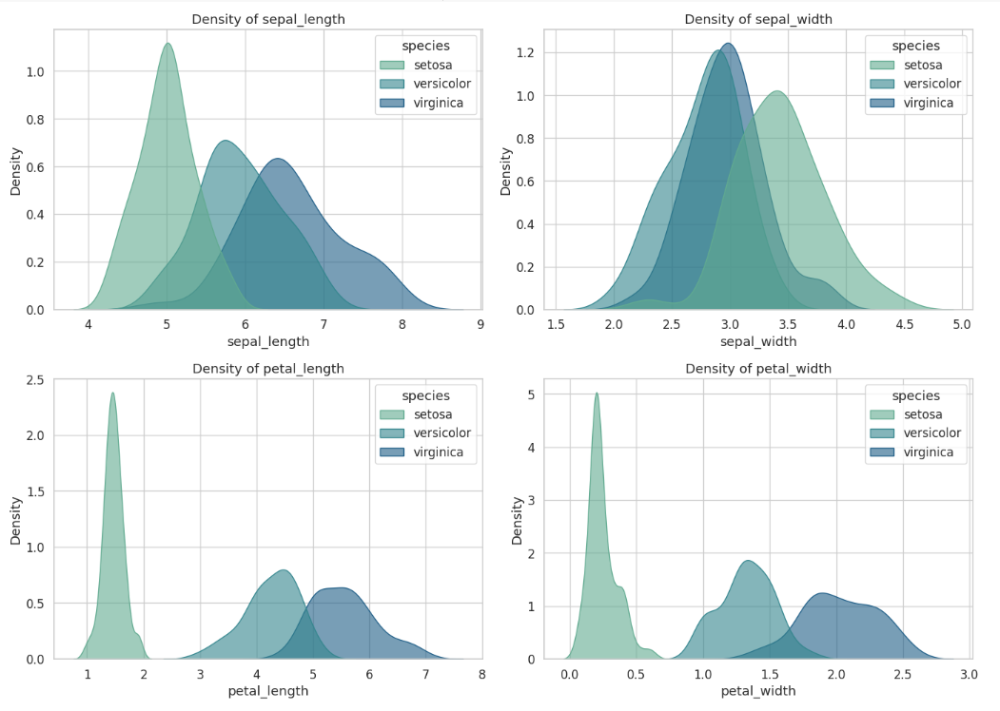
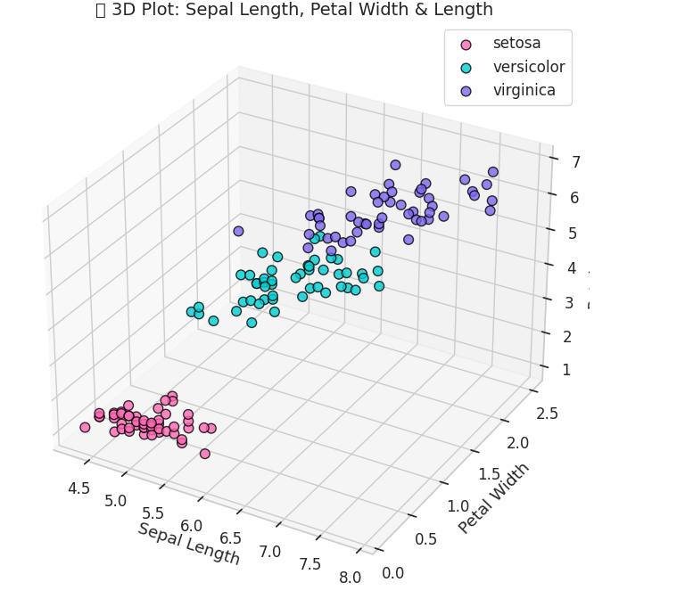

# 🌸 Iris Dataset Exploration & Visualization

This Jupyter Notebook provides a complete exploration of the famous **Iris flower dataset** using `pandas`, `matplotlib`, and `seaborn`. It includes rich visualizations and summary statistics to understand the relationships and distributions among the features.

---

## 📁 Dataset
- **Source**: Built-in Seaborn Iris dataset (no download required)
- **Features**:
  - Sepal Length
  - Sepal Width
  - Petal Length
  - Petal Width
  - Species (setosa, versicolor, virginica)

---

## 🔍 What This Notebook Covers

### ✅ Data Loading & Inspection
- Load the dataset with pandas
- Display shape, column names, info, and descriptive statistics

### 📊 Visualizations (15+ Unique Beautiful Plots)

1. **Scatter Plot** – Sepal Length vs Sepal Width
2. **Histograms** – Feature-wise distributions
3. **Box Plots** – Identify outliers by species
4. **Custom Pairwise Scatter Matrix** (Matplotlib corner-style)
5. **Correlation Heatmap**
6. **KDE Plots** – Smoothed feature density by species
7. **Violin Plots** – Distribution and spread
8. **Swarm Plot** – Petal Length distribution
9. **Strip Plot** – Sepal Width variation
10. **3D Scatter Plot 1** – Sepal Length, Sepal Width, Petal Length
11. **3D Scatter Plot 2** – Sepal Length, Petal Width, Petal Length

All plots are **color-coded by species** with **aesthetic palettes** and formatted using `tight_layout()` and clean legends.

---

## 🛠️ Technologies Used

- Python 3.x
- pandas
- seaborn
- matplotlib
- numpy

---

## 📌 How to Run

1. Open the notebook (`.ipynb`) in Jupyter Lab / Notebook / VSCode.
2. Run all cells sequentially.
3. No external files needed – dataset loads from seaborn.

---

## 📷 Preview

| Plot Type       | Example               |
|----------------|------------------------|
| KDE Plot        |  |
| 3D Plot         |  |

---

## 📚 Learning Objectives

- Understand basic EDA techniques
- Practice statistical analysis using pandas
- Build various plots using seaborn and matplotlib
- Gain insights into the structure of multi-class datasets

---

## 🧠 Author

**Zain ul Abdeen**  
🎓 BS in Artificial Intelligence  
🔗 [GitHub](https://github.com/Zain-ul-abdeen-773)  
🔗 [Portfolio](https://zain-ul-abdeen-773.netlify.app/)  
🔗 [LinkedIn](http://www.linkedin.com/in/zain-ul-abdeen-48aa72318)

---

## ✅ License

This project is open for educational use and practice under the [MIT License](LICENSE).

---
